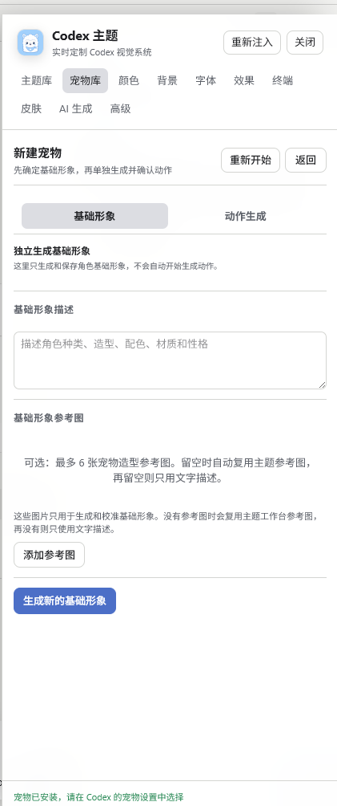
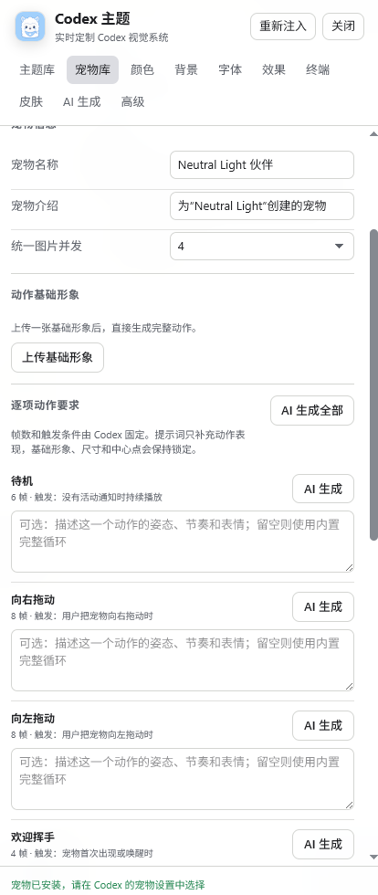
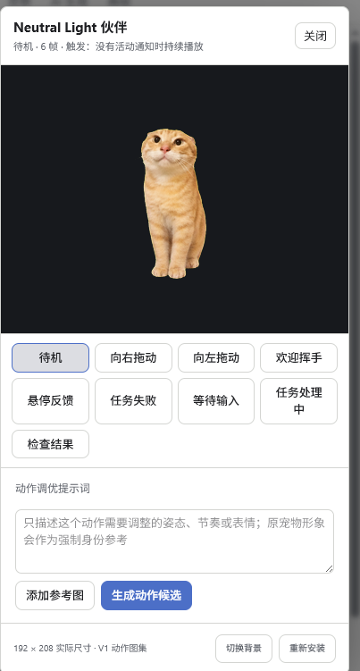

# Theme Inject

English | [简体中文](README.md)

A standalone theme and pet manager for Codex on Windows.

Theme Inject uses the Chromium DevTools Protocol (CDP) to inject a runtime into the Codex renderer. It adds a theme panel, theme library, background controls, advanced skins, an AI theme workspace, and a pet library without modifying the Codex installation. You can also import community pets, generate your own animated pet, and share a companion pet with its theme.

> This project is under active development. Features, UI, and compatibility may change.


## Features

- Starts and connects to Codex for Windows automatically.
- Adds an in-app theme launcher and a live editing panel.
- Styles the sidebar, conversations, composer, dialogs, code blocks, terminal, and other workspace surfaces.
- Controls colors, fonts, corner radius, opacity, blur, saturation, shadows, and terminal colors.
- Supports unified fullscreen backgrounds or separate content and sidebar backgrounds.
- Imports, exports, duplicates, deletes, and switches local themes immediately.
- Supports advanced skin assets including logos, watermarks, hero images, avatars, action icons, home cards, decorations, and component surfaces.
- Generates theme drafts and image assets through OpenAI-compatible text, vision, and image APIs.
- Keeps generation checkpoints, resumes failed assets, exposes request logs, and regenerates individual resources.
- Includes a pet library for previewing, importing, exporting, editing, and installing Codex V1/V2 and community pet packages.
- Generates one pet identity image and nine standard animations with per-action prompts, action tuning, generation in the background, and checkpoint resume.
- Binds a companion pet to a theme and carries it inside theme exports without overwriting an existing local pet on import.
- Checks GitHub Releases, downloads and verifies updates, then safely replaces and restarts the application.
- Detects the system language and loads the Simplified Chinese or English UI from JSON locale files.

## Recent Additions

- Added a full pet library with V1/V2 support, community ZIP compatibility, animated previews, metadata editing, import/export, and safe installation into Codex.
- Added AI pet creation with separate Identity and Actions tabs on the same page, dedicated pet references, direct base-image upload, per-action prompts, and AI-generated prompt suggestions.
- Added resumable background pet generation. The identity image is reviewed before actions begin, and completed work remains available after cancellation, API errors, or closing the panel.
- Improved sprite processing with fixed `192x208` cells, stable subject scale, center and baseline registration, multi-stage slicing, chroma cleanup, lossless WebP output, and automatic retry for undersized actions.
- Added theme-to-pet binding so a companion pet travels with theme ZIP exports and imports without replacing an existing pet with the same ID.
- Added GitHub update checks, download progress, cancellation, SHA-256 verification, restart installation, and rollback. Development builds are protected from replacing themselves.

## Theme Gallery

Every ZIP below can be downloaded directly and imported from the theme library.

| Theme | Preview | Style |
| --- | --- | --- |
| [Gundam](themes/高达主题.zip)<br>Dark |  | A deep-blue space hangar and metallic mecha theme with high-contrast glass panels. |
| [CLANNAD Dango Daikazoku](themes/团子大家族主题.zip)<br>Light |  | A soft cherry-blossom campus theme with bright, readable surfaces and dango decorations. |
| [Rain](themes/雨姐主题.zip)<br>Light |  | A sweet pink theme built around strawberries, ribbons, lace, character art, and custom decorations. |
| [ikun](themes/ikun.zip)<br>Dark |  | A dark stage with blue and orange basketball accents, custom imagery, icons, and corner decorations. |
| [Lu Benwei](themes/卢本伟.zip)<br>Dark |  | A purple esports stage with bright-blue accents, playing-card details, coffee motifs, and a complete custom icon set. |
| [Family Guy](themes/恶搞之家.zip)<br>Dark |  | An American cartoon theme combining a suburban night scene with a low-distraction dark workspace. |
| [KFC](themes/肯德基.zip)<br>Light |  | A bright red-and-white theme with warm restaurant lighting, food details, and custom feature icons. |
| [McDonald's](themes/麦当劳.zip)<br>Dark |  | Deep red and gold surfaces with food imagery and translucent dark work panels. |
| [Orange Cat](themes/耄耋.zip)<br>Dark |  | A calm, warm theme with a close-up orange cat, wooden tones, and muted dark panels. |
| [Round Head and Orange Cat](themes/圆头与耄耋.zip)<br>Dark |  | A desert science-fiction cartoon theme with cyan skies, yellow suits, and vivid red details. |
| [GG Bond](themes/猪猪侠.zip)<br>Dark |  | A vivid red-and-gold hero theme with motion lighting, character icons, and translucent cards. |

## Configuration UI

| Theme library | Advanced skin configuration |
| --- | --- |
|  |  |

The Effects tab controls radius, borders, opacity, blur, saturation, and shadows. It also includes animated meteors, rain, snow, starlight, fireflies, and petals.


## Usage

1. Close every running Codex window.
2. Run `theme-inject.exe`.
3. Theme Inject starts Codex with a CDP debugging port.
4. Click the theme button in the bottom-right corner of Codex.
5. Select a theme or edit its colors, background, effects, and skin, then click Apply.
6. Open the Pet Library to import a pet, or choose New Pet to generate your own.

Starting Theme Inject again while an instance is already running opens the existing theme panel.

Optional command-line arguments:

```text
theme-inject --app-path <path-to-Codex>
theme-inject --debug-port <port>
theme-inject --open-panel
```

Theme data is stored in:

```text
%LOCALAPPDATA%\ThemeInject
```

Diagnostic logs are stored in:

```text
%LOCALAPPDATA%\ThemeInject\logs\theme-inject.log
```

## AI Theme Workspace

The AI workspace combines the theme request, reference images, resource plans, progress, request logs, and a static preview.

- Reference images are analyzed before resources are assigned to backgrounds, hero images, logos, avatars, decorations, and card icons.
- Individual assets can be generated or replaced without regenerating the whole theme. Palette-only regeneration preserves existing images.
- Up to four image requests can run concurrently.
- Completed assets remain available when generation is interrupted. Submitting the same request resumes missing resources from its checkpoint.
- Preview assets use a controlled local server and thumbnail fallbacks to limit renderer memory use.

Configure the base model, image model, API URL, and keys under **Advanced > AI Generation**. Third-party API charges may apply.

## Pet Library and AI Pet Creation

The pet library manages native Codex packages and community pet ZIP files. It can also create an animated pet from reference images or a text description.

| Generate the identity | Configure and generate actions | Preview and tune actions |
| --- | --- | --- |
|  |  |  |

### Import, Export, and Installation

- Supports Codex V1 `1536x1872` and V2 `1536x2288` WebP atlases.
- Accepts community packages whose runtime files are at the ZIP root or inside one top-level folder. Legacy V1 packages without a version field are inferred from atlas dimensions.
- Validates archive paths, sizes, manifests, atlas dimensions, and runtime files while preserving additional marketplace metadata when the name or description is edited.
- Revalidates a pet before installation. An existing pet with the same ID is backed up first and restored if installation fails.
- Removing a pet from the Theme Inject library does not remove the copy already installed in Codex.

After installation, select the pet under **Codex Settings > Pets**. Theme Inject does not bypass Codex settings to change the currently selected pet.

### Creation Workflow

1. Describe the character under Identity and optionally add up to six pet reference images. If none are supplied, Theme Inject reuses AI theme references, then falls back to text only.
2. Generate and approve one identity image, or upload an existing base image directly from the Actions tab.
3. Add a separate prompt for each of the nine standard actions, or ask AI to suggest one action prompt or all prompts.
4. Generate actions with the shared image-concurrency setting. Identity, apparent size, center, and baseline remain locked across the set.
5. Preview the result and add it to the library. Any single action can be regenerated with a new prompt and references without changing the other rows.

The nine standard actions are idle, drag left, drag right, welcome wave, hover response, task failed, waiting for input, task processing, and result review. Frame counts and triggers are defined by Codex; Theme Inject generates each row against the actual trigger meaning and requires a complete animation loop.

Generation can continue after the pet window is closed. Cancellation, API failures, or slicing failures preserve the identity and completed actions so the next session can resume missing work.

Newly generated pets use the nine-row V1 atlas. Existing V2 community pets can still be imported, exported, and installed.

### Companion Pets in Theme Packages

A pet can be bound to the current theme from the pet library. Theme exports then include the companion `pet.json` and `spritesheet.webp`. Importing that theme also adds the pet to the library, but never replaces an existing local pet with the same ID.

## Updates

The Advanced page can check the latest stable Theme Inject release on GitHub. When an update is available, it displays release information and download progress and allows cancellation. Only a package that passes SHA-256 verification can be installed.

Theme Inject backs up the current executable before replacement, restarts after installation, and restores the previous executable if the new version cannot start. Themes, pets, AI settings, checkpoints, and logs live in a separate data directory and are not removed by an application update.

Development builds under a `target` directory can check for updates but cannot replace themselves.

## Build

Requirements:

- Windows
- Rust 1.85 or later

Build the release binary from the project root:

```powershell
cargo build --release
```

The executable is written to:

```text
target\release\theme-inject.exe
```

For development rebuilds and reinjection:

```powershell
powershell -ExecutionPolicy Bypass -File .\scripts\restart-dev.ps1
```

Runtime source is organized by responsibility under `assets/runtime/`. Rust concatenates those modules into one closure at compile time. JSON locale files live under `assets/locales/`.

Pushing the `clean-version` branch runs the GitHub Actions tests, builds a Windows release, and uploads separate ZIP archives for the application and the complete sample-theme collection. Both archives include SHA-256 checksum files.

## Safety Notes

Theme Inject does not modify `app.asar`, the Codex installation directory, or `~/.codex`. It injects the theme runtime through CDP.

The project is still experimental:

- It launches Codex with a debugging port and may require updates for future Codex versions.
- A broken style can affect the current renderer. Closing and reopening Codex restores the original UI.
- Custom CSS is disabled by default and only runs after explicit trust is granted.
- AI generation can incur third-party API charges.
- Theme ZIP files are validated for size, paths, and extensions, but you should still import themes only from trusted sources.
- Pet ZIP files are also validated for paths, size, manifest, and atlas structure, but should still come from a trusted community source.
- Application updates verify the expected GitHub Release asset and SHA-256 checksum. Windows Authenticode signing is not yet enabled.

## Theme Package Format

A theme package is a ZIP with at least this file at its root:

```text
theme.json
```

Optional files:

```text
custom.css
preview.png
assets/
pets/<pet-id>/     # optional bound companion pet
  pet.json
  spritesheet.webp
```

Imported themes appear in the theme library and can be switched immediately. Exported ZIP files include the manifest, referenced local image assets, and the runtime files for a bound companion pet.

## Development Checks

Run these checks before committing or publishing:

```powershell
cargo fmt --all -- --check
cargo test
cargo clippy --all-targets -- -D warnings
node scripts/check-runtime.mjs
```

## More Documentation

- [Original full documentation](docs/original-readme.md)
- [Theme refactor and compatibility notes](docs/theme-refactor-todo.md)
- [Pet generation and management branch summary](docs/宠物生成与管理分支变更汇总.md)
