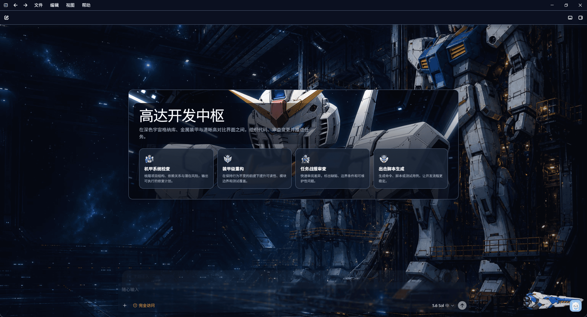
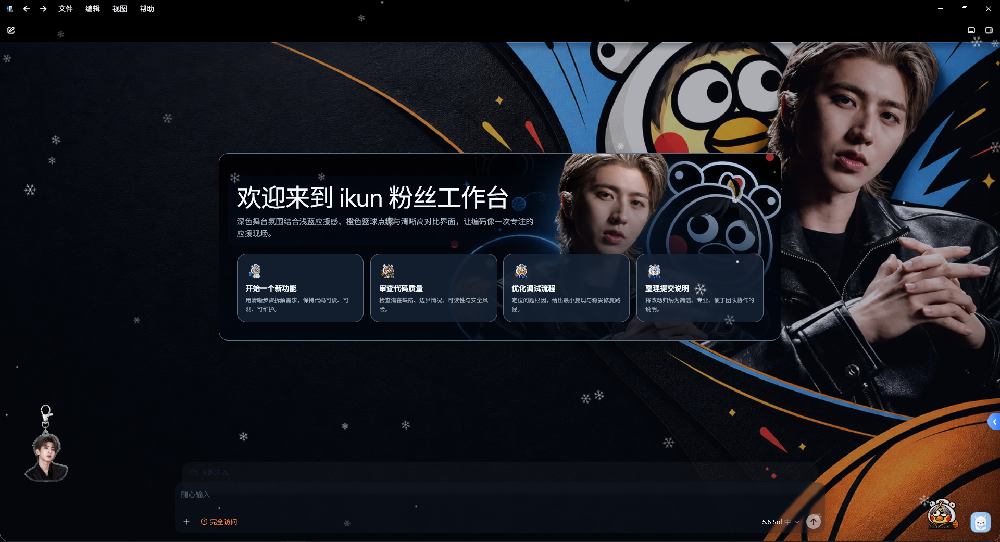
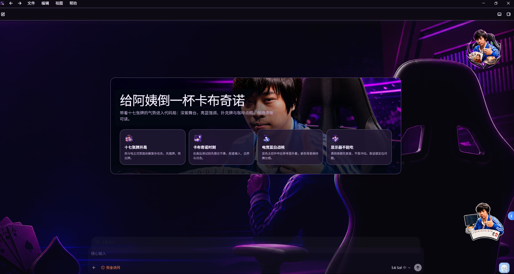
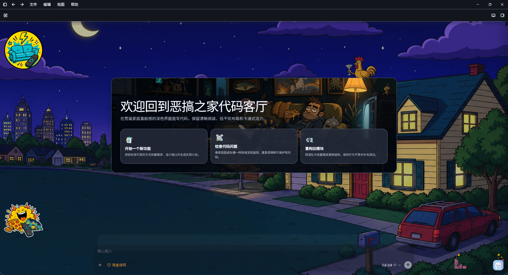
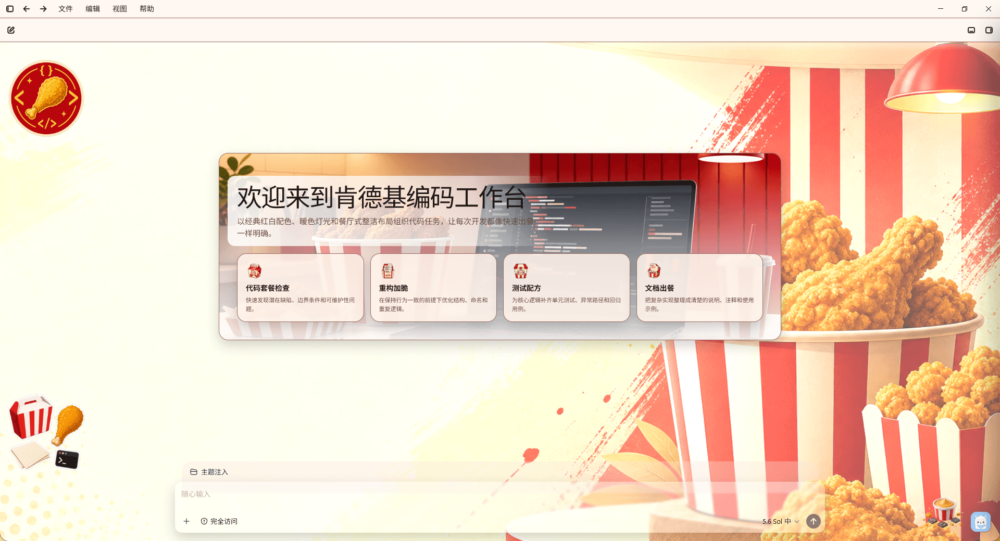
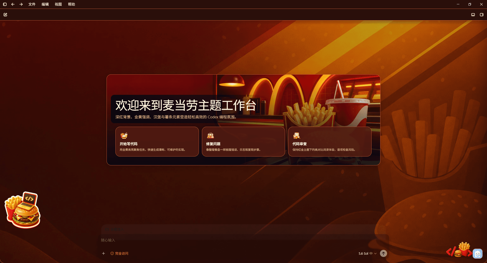
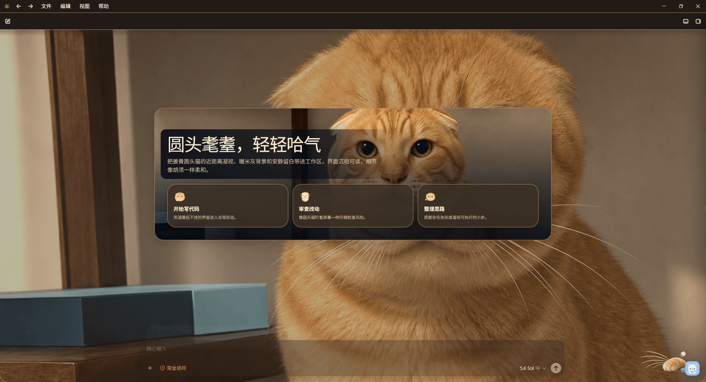
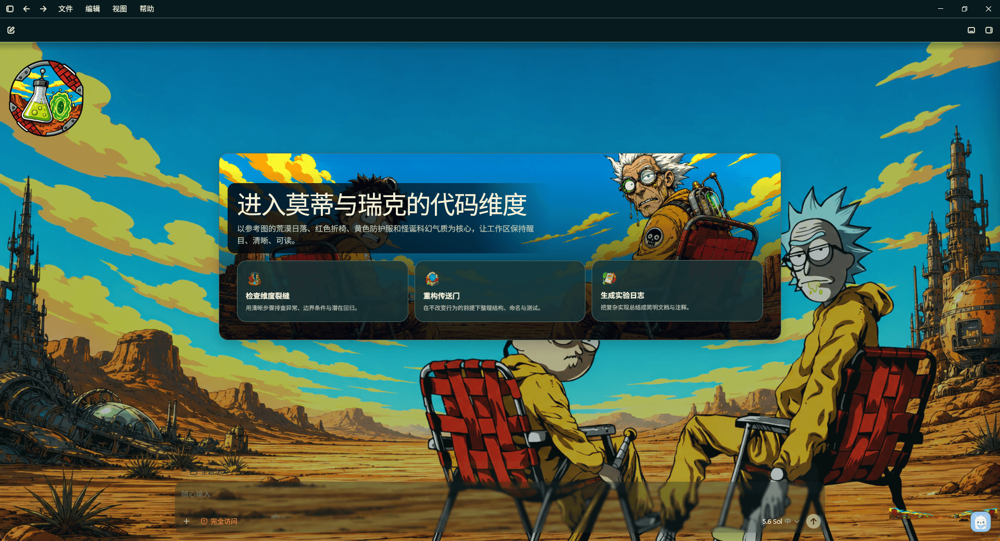
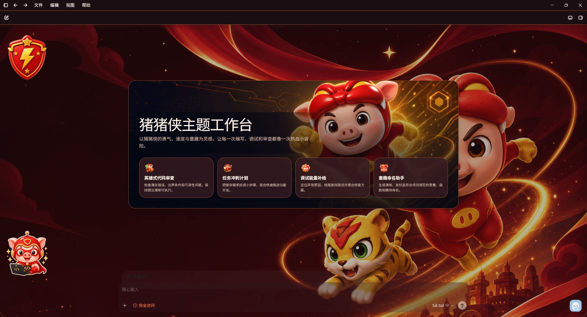
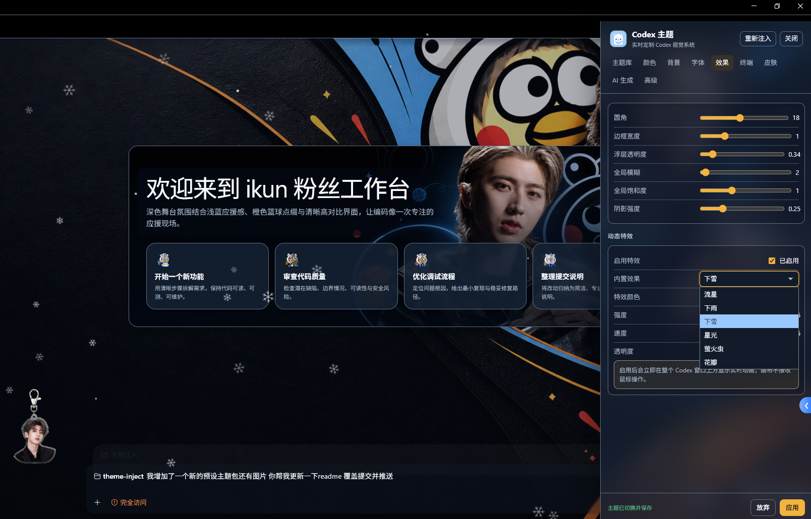

# Theme Inject

[English](README.en.md) | 简体中文

一个给 Windows 版 Codex 注入自定义主题的独立启动器。

Theme Inject 会通过 Chromium DevTools Protocol（CDP）把主题运行时注入到 Codex renderer 中，并在 Codex 内提供主题面板、主题库、背景配置、高级皮肤和 AI 主题工作台。它的目标很简单：让 Codex 不只好用，也能长成你喜欢的样子。

> 仍在开发版本中，功能、界面和兼容性都可能继续调整。Bug 仍在修复中，欢迎反馈问题。
>
> 你的 Star 就是我更新的动力。


## 项目能做什么

- 自动启动并连接 Windows 版 Codex。
- 在 Codex 里显示“主题”按钮和实时编辑面板。
- 支持侧边栏、对话、输入区、弹窗、代码块、终端等区域的主题覆盖。
- 支持颜色、字体、圆角、透明度、模糊和终端配色调整；布局由主题运行时自动约束。
- AI 主题不会注入或强行改变 Codex 原生侧边栏宽度，默认侧边栏基准为 300px，避免主题超出界限。
- 支持全屏统一背景，也支持内容区和侧边栏分别配置背景。
- 支持本地背景图、主题导入、主题导出、复制、删除和即时切换。
- 支持高级皮肤：Logo、侧栏水印、Hero 图、头像、动作图标、首页卡片图标、装饰层和组件表面等。
- 支持兼容 OpenAI 协议的 AI 主题生成，可从文字或参考图生成主题草稿和图片资源；没有参考图时也会自动生成默认资源。
- 支持主题包检查点、失败资源续跑、实时请求日志和资源级别的重新生成。
- 主题面板会检测系统语言，使用 JSON 语言包自动显示简体中文或英文界面。

## 新增与改进

- 重做 AI 主题工作台：支持文字需求、参考图分析、界面语言选择、生成请求日志，以及主题生成与已有主题编辑两种工作模式。
- 完善图片资源流程：可生成背景、Hero、Logo、头像、装饰和首页卡片图标，支持最多 4 路并发、单项重新生成、候选结果预览与覆盖应用。
- 增加检查点和失败恢复：生成中断后保留已完成资源，再次提交相同需求时从缺失项继续；切换主题时会清理旧的 staging 状态。
- 优化预览与内存占用：使用本地资源服务和缩略图加载预览，生成期间不反复刷新 Codex 主 DOM，并提供手动刷新预览 DOM 的入口。
- 扩展高级皮肤能力：补充动作图标、首页卡片图标、可拖动装饰层、组件表面和动态画布特效，改善标题栏、左右侧栏、对话、代码块和终端的主题适配。
- 改善可用性与性能：修复生成中断、装饰编辑、资源进度、图标图集和主题切换问题，降低动态特效与对话切换带来的渲染开销。
- 完善开发与发布流程：开发构建支持双槽位重建、自动重启和重新注入；GitHub Actions 可自动测试、构建 Release 并打包示例主题。
- 新增并更新 11 个可导入的示例主题，覆盖动漫、影视、品牌、角色和趣味视觉风格。

## 主题预览

下列主题包均可直接下载 ZIP，并在“主题库”中导入。预览图来自主题实际应用效果。

| 主题 | 预览 | 风格与说明 |
| --- | --- | --- |
| [高达主题](themes/高达主题.zip)<br>深色 |  | 深蓝宇宙机库与金属机甲风格，高对比玻璃面板搭配机体图标，适合偏冷峻、科技感的工作区。 |
| [CLANNAD 团子大家族](themes/团子大家族主题.zip)<br>浅色 |  | 樱花校园、柔和粉白配色与团子装饰组成的治愈系主题，在明亮背景下兼顾代码和正文可读性。 |
| [雨姐主题](themes/雨姐主题.zip)<br>浅色 |  | 草莓、蝴蝶结和蕾丝元素构成的粉色甜美风格，包含人物 Hero、头像与多处装饰资源。 |
| [ikun](themes/ikun.zip)<br>深色 |  | 深色舞台氛围结合蓝橙篮球元素，配有定制人物背景、头像、卡片图标和角落装饰。 |
| [卢本伟](themes/卢本伟.zip)<br>深色 |  | 深紫电竞舞台搭配亮蓝强调色，以人物 Hero、扑克牌和咖啡元素构成高辨识度工作区，并配有完整的定制功能图标。 |
| [恶搞之家](themes/恶搞之家.zip)<br>深色 |  | 深夜郊区与动画客厅构成的美式卡通风格，使用低干扰深色面板保持内容清晰。 |
| [肯德基](themes/肯德基.zip)<br>浅色 |  | 经典红白品牌配色、暖色餐厅灯光和炸鸡元素，整体明亮活泼并配有专属功能图标。 |
| [麦当劳](themes/麦当劳.zip)<br>深色 |  | 深红、金黄与汉堡薯条元素组成的暖色主题，半透明深色工作面板突出前景内容。 |
| [耄耋](themes/耄耋.zip)<br>深色 |  | 以圆润橘猫近景为主视觉，结合暖木色背景和低饱和深色面板，氛围安静柔和。 |
| [圆头与耄耋](themes/圆头与耄耋.zip)<br>深色 |  | 荒漠科幻动画风格，青蓝天空、黄色防护服与红色折椅形成强烈对比，辨识度鲜明。 |
| [猪猪侠](themes/猪猪侠.zip)<br>深色 |  | 红金英雄视觉与流光背景结合，使用角色化图标、装饰和半透明卡片营造热烈动感。 |

主题库和皮肤配置界面：

| 主题库 | 高级皮肤配置 |
| --- | --- |
|  |  |

效果设置支持圆角、边框、透明度、模糊、饱和度和阴影调整，也可以启用流星、下雨、下雪、星光、萤火虫和花瓣等动态特效：



## 使用方法

1. 关闭所有正在运行的 Codex 窗口。
2. 运行 `theme-inject.exe`。
3. Theme Inject 会带着 CDP 参数启动 Codex。
4. 进入 Codex 后，点击右下角的“主题”按钮。
5. 在面板里选择主题、调整颜色/背景/皮肤，点击“应用”保存。

再次运行 Theme Inject 时，如果已有实例在运行，会通知已有实例打开主题面板。

## AI 主题工作台

打开“AI 生成主题”后，可以在同一个工作台中填写主题需求、选择界面语言、粘贴或上传参考图、配置图片资源和查看请求日志。

- 参考图会先由视觉模型分析，随后按资源用途分配到背景、Hero、Logo、头像、装饰和卡片图标等生成任务；没有参考图时使用纯文字生成，并自动补齐必要资源。
- “资源”标签页可以单独生成或覆盖某一个资源，不需要重新生成整套主题；“只重新生成配色”不会改动已有图片资源。
- 图片最多支持 4 路并发。生成期间不会刷新 Codex 主 DOM，生成完成后点击“刷新预览 DOM”才查看和调整静态预览，降低 renderer 内存压力。
- 生成失败时会保留已经完成的资源；使用相同需求再次生成可以从缺失资源继续。A 主题切换到 B 主题时，工作台会清理旧 staging 资源和进度状态。
- 预览资源使用受控的本地 staging 服务和缩略图兜底，不会把整批原图直接复制到预览 DOM。

基础模型、生图模型、API 地址和 Key 在“高级 → AI 生成”中配置。AI 请求可能产生第三方 API 费用，请确认模型服务商的计费方式。

可选启动参数：

```text
theme-inject --app-path <Codex 路径>
theme-inject --debug-port <端口>
theme-inject --open-panel
```

主题数据默认保存在：

```text
%LOCALAPPDATA%\ThemeInject
```

诊断日志位于：

```text
%LOCALAPPDATA%\ThemeInject\logs\theme-inject.log
```

## 如何编译

需要：

- Windows
- Rust 1.85 或更高版本

在项目根目录执行：

```powershell
cargo build --release
```

编译完成后，程序位于：

```text
target\release\theme-inject.exe
```

开发时可以使用脚本重新构建并附加：

```powershell
powershell -ExecutionPolicy Bypass -File .\scripts\restart-dev.ps1
```

注入运行时按职责拆分在 `assets/runtime/` 中，由 Rust 在编译时按顺序拼装为同一个闭包。界面语言包位于 `assets/locales/`。

推送到 `clean-version` 分支时，GitHub Actions 会自动运行测试、构建 Windows Release，并上传包含程序、README 和示例主题包的 ZIP 构件。

## 有没有风险

Theme Inject 不会修改 Codex 的 `app.asar`、安装目录或 `~/.codex` 配置，它是通过 CDP 在运行时注入主题脚本。

不过它仍然属于开发版本，请注意：

- 需要以带调试端口的方式启动 Codex，可能与 Codex 后续版本存在兼容问题。
- 它会影响当前 Codex renderer 的页面表现，遇到显示异常时可以关闭 Codex 后重新启动。
- 自定义 CSS 默认禁用；只有你显式启用并信任后才会执行。
- AI 生成功能可能产生第三方 API 费用，Theme Inject 不会在未点击生成时主动请求 AI 服务。
- 主题 ZIP 导入虽然做了大小、路径和扩展名校验，但仍建议只导入可信来源的主题包。

如果你追求绝对稳定，建议等待后续更成熟的版本；如果你愿意一起试用和反馈，那就欢迎上车。

## 主题包

主题包是 ZIP，根目录至少包含：

```text
theme.json
```

可选文件：

```text
custom.css
preview.png
assets/
```

导入主题后，主题会进入主题库；点击卡片即可立即切换。导出的 ZIP 会包含主题配置和引用的本地图片资源。

仓库内的示例主题包均可直接导入，完整列表、预览图和风格说明见上方“主题预览”表格。

## 开发验证

提交或发布前建议运行：

```powershell
cargo fmt --all -- --check
cargo test
cargo clippy --all-targets -- -D warnings
node scripts/check-runtime.mjs
```

## 更多文档

- 旧版完整说明：[docs/original-readme.md](docs/original-readme.md)
- 主题重构与兼容记录：[docs/theme-refactor-todo.md](docs/theme-refactor-todo.md)
