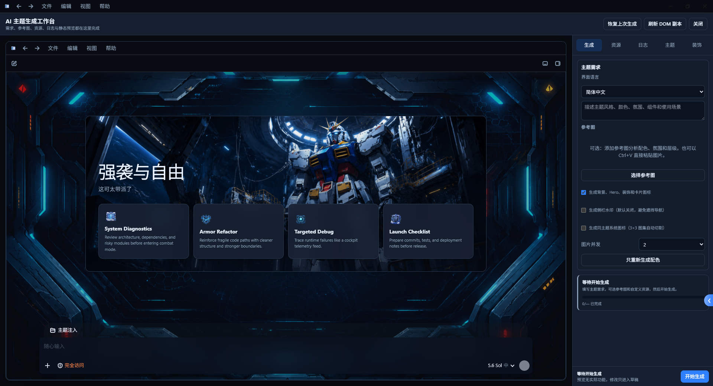
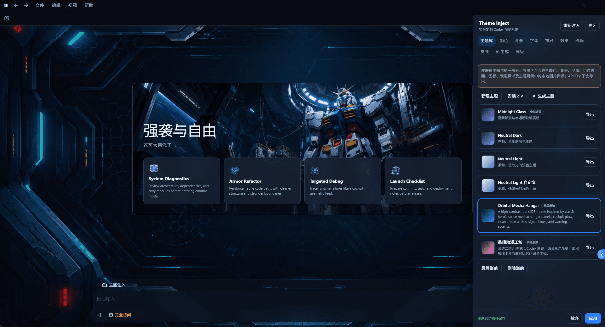
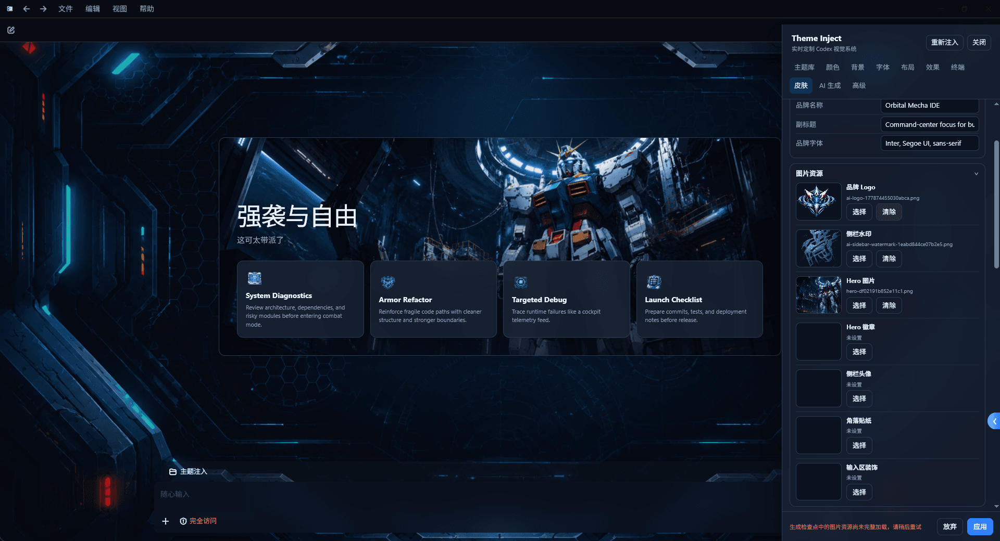
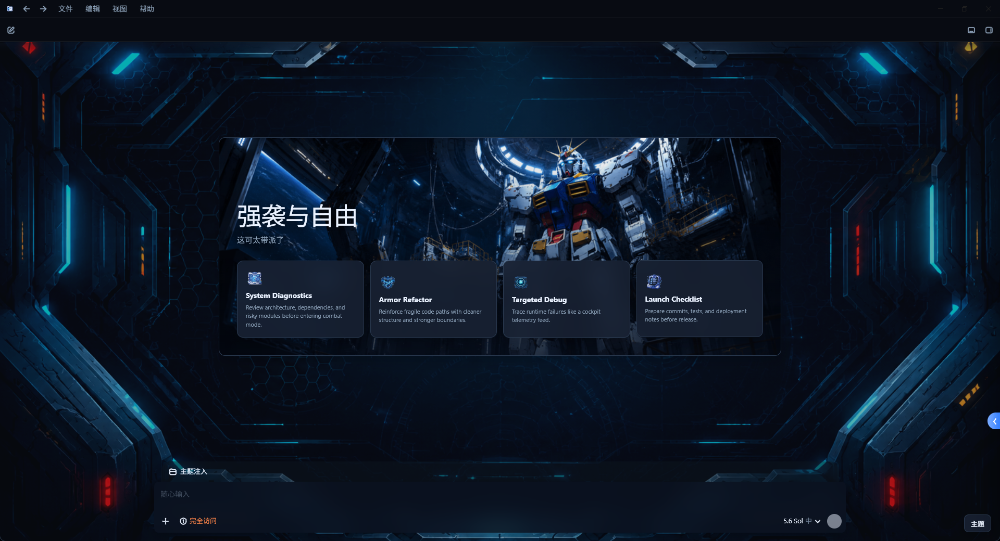
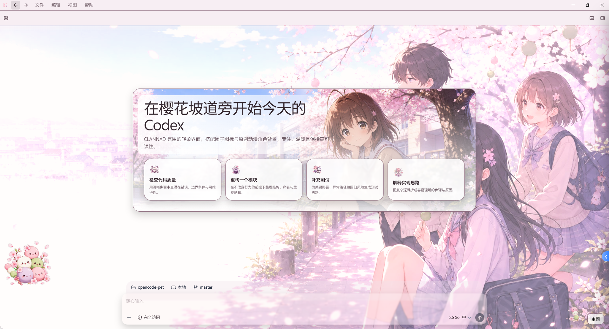
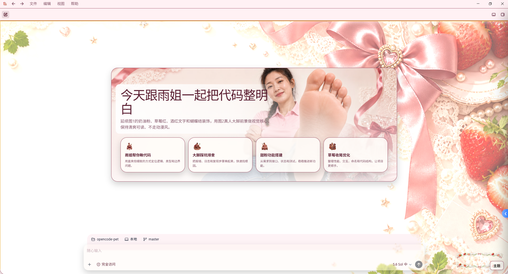
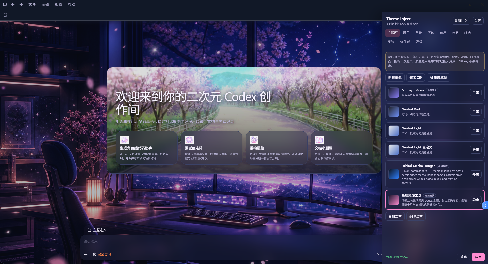

# Theme Inject

一个给 Windows 版 Codex 注入自定义主题的独立启动器。

Theme Inject 会通过 Chromium DevTools Protocol（CDP）把主题运行时注入到 Codex renderer 中，并在 Codex 内提供主题面板、主题库、背景配置、高级皮肤和 AI 主题工作台。它的目标很简单：让 Codex 不只好用，也能长成你喜欢的样子。

> 仍在开发版本中，功能、界面和兼容性都可能继续调整。Bug 仍在修复中，欢迎反馈问题。
>
> 你的 Star 就是我更新的动力。



## 项目能做什么

- 自动启动并连接 Windows 版 Codex。
- 在 Codex 里显示“主题”按钮和实时编辑面板。
- 支持侧边栏、对话、输入区、弹窗、代码块、终端等区域的主题覆盖。
- 支持颜色、字体、布局、圆角、透明度、模糊和终端配色调整。
- 支持全屏统一背景，也支持内容区和侧边栏分别配置背景。
- 支持本地背景图、主题导入、主题导出、复制、删除和即时切换。
- 支持高级皮肤：Logo、侧栏水印、Hero 图、头像、装饰层、组件表面等。
- 支持兼容 OpenAI 协议的 AI 主题生成，可从文字或参考图生成主题草稿和图片资源。

## 效果预览













## 使用方法

1. 关闭所有正在运行的 Codex 窗口。
2. 运行 `theme-inject.exe`。
3. Theme Inject 会带着 CDP 参数启动 Codex。
4. 进入 Codex 后，点击右下角的“主题”按钮。
5. 在面板里选择主题、调整颜色/背景/布局/皮肤，点击“应用”保存。

再次运行 Theme Inject 时，如果已有实例在运行，会通知已有实例打开主题面板。

可选启动参数：

```text
theme-inject --app-path <Codex 路径>
theme-inject --debug-port <端口>
theme-inject --open-panel
```

主题数据默认保存在：

```text
%LOCALAPPDATA%\ThemeInject
```

诊断日志位于：

```text
%LOCALAPPDATA%\ThemeInject\logs\theme-inject.log
```

## 如何编译

需要：

- Windows
- Rust 1.85 或更高版本

在项目根目录执行：

```powershell
cargo build --release
```

编译完成后，程序位于：

```text
target\release\theme-inject.exe
```

开发时可以使用脚本重新构建并附加：

```powershell
powershell -ExecutionPolicy Bypass -File .\scripts\restart-dev.ps1
```

推送到 `clean-version` 分支时，GitHub Actions 会自动运行测试、构建 Windows Release，并上传包含程序、README 和示例主题包的 ZIP 构件。

## 有没有风险

Theme Inject 不会修改 Codex 的 `app.asar`、安装目录或 `~/.codex` 配置，它是通过 CDP 在运行时注入主题脚本。

不过它仍然属于开发版本，请注意：

- 需要以带调试端口的方式启动 Codex，可能与 Codex 后续版本存在兼容问题。
- 它会影响当前 Codex renderer 的页面表现，遇到显示异常时可以关闭 Codex 后重新启动。
- 自定义 CSS 默认禁用；只有你显式启用并信任后才会执行。
- AI 生成功能可能产生第三方 API 费用，Theme Inject 不会在未点击生成时主动请求 AI 服务。
- 主题 ZIP 导入虽然做了大小、路径和扩展名校验，但仍建议只导入可信来源的主题包。

如果你追求绝对稳定，建议等待后续更成熟的版本；如果你愿意一起试用和反馈，那就欢迎上车。

## 主题包

主题包是 ZIP，根目录至少包含：

```text
theme.json
```

可选文件：

```text
custom.css
preview.png
assets/
```

导入主题后，主题会进入主题库；点击卡片即可立即切换。导出的 ZIP 会包含主题配置和引用的本地图片资源。

仓库提供以下示例主题包，可下载后在主题库中直接导入：

- [团子大家族主题](themes/团子大家族主题.zip)
- [雨姐主题](themes/雨姐主题.zip)
- [高达主题](themes/高达主题.zip)

## 开发验证

提交或发布前建议运行：

```powershell
cargo fmt --all -- --check
cargo test
cargo clippy --all-targets -- -D warnings
node --check assets/theme-runtime.js
```

## 更多文档

- 旧版完整说明：[docs/original-readme.md](docs/original-readme.md)
- 主题重构与兼容记录：[docs/theme-refactor-todo.md](docs/theme-refactor-todo.md)
